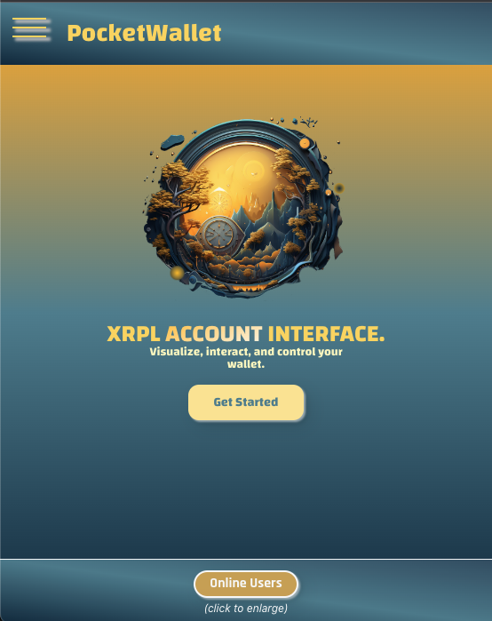
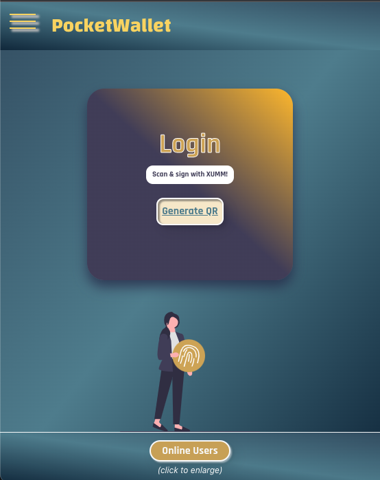
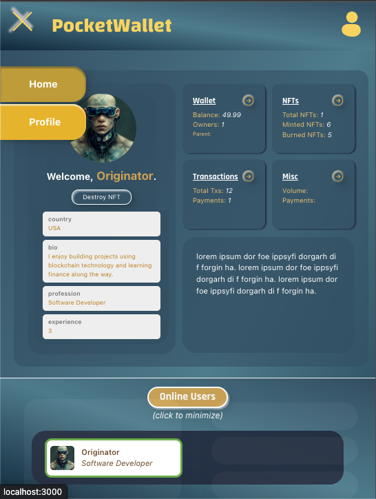

# PocketWallet

### Dependencies:   ___XRPl API, XUMM SDK, SOCKET.IO___ 
 

Verify XRP Ledger account ownership to view, interact, and communicate with other connected users. User interface to make interactions with your wallet seamless. View balances, previous transactions, NFT tokens, and much more.
 
 

### Features:
 

- Login via XUMM sign-in QR Payload
- Mint Identity NFT with information from form submit
- Destroy current Identity NFT via 'Destroy NFT' button
- View online users
- Online user color coded border rank system based on owned xrp amount
- View account transactions, nfts, balances, and much more

 
### Future Features:
 

- chat with online users
- view online users profiles
- seperate nft page
- seperate transactions page (visual charts and organized data)
- filter account payment transactions totals by labeled address / time frame

 

## Website Preview Images: 

 

 

 

 
